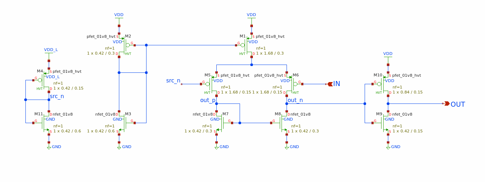

<!---

This file is used to generate your project datasheet. Please fill in the information below and delete any unused
sections.

You can also include images in this folder and reference them in the markdown. Each image must be less than
512 kb in size, and the combined size of all images must be less than 1 MB.
-->

## How it works

Danger! Enabling this design without first removing the 3.3v VAPWR will blow the design.

The 3.3v VAPWR rail is used as a variable supply to a single inverter. You must remove the VDDA 0 ohm resistor on the breakout board, and provide 1.8v.

The [traditional level shifter](https://xschem-viewer.com/?file=https://github.com/mattvenn/tt10-level-shifter/blob/main/xschem/level_shifter.sch) only works down to about 1v.

This [level shifter](https://xschem-viewer.com/?file=https%3A%2F%2Fgithub.com%2Fmattvenn%2Ftt10-level-shifter%2Fblob%2Fmain%2Fxschem%2Flevel_shifter2.sch) was designed by Sylvain Munaut and operates down to around 0.2v.

* M4 and M11 create a reference voltage `src_n` about half of VDD_L.
* M2, M3 and M1 create a current source for the differential pair.
* M5 and M6 are the differential pair, with the `src_n` on one side and the input on the other.
* M7 and M8 are the current mirror, along with M1, M5 and M6 they create the classical opamp comparitor.
* Finally the output is buffered through M10 and M9 as an inverter.

The design features 2 of these level shifters, one connected between ui_in[0] and uo_out[0], and the other between ua[1] and ua[0].

## How to test

TBD.

## External hardware

Scope.
